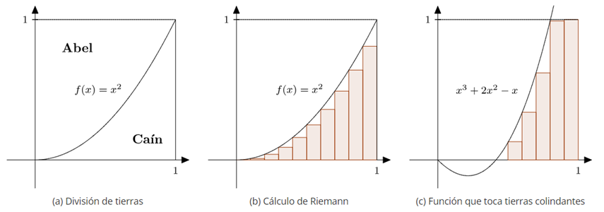

# Problemas de Herencia
Caín y Abel han heredado el pedazo de tierra de su padre y deben proceder a dividirlo en **dos partes iguales**. Sabiendo que la tierra es un cuadrado de una hectárea (un cuadrado de 1x1 hectómetro), lo más fácil sería dividirlo directamente por la mitad.

Sin embargo, Caín y Abel se han complicado un poco poniendo en práctica sus conocimientos matemáticos. En concreto, cada uno de ellos va proponiendo al otro una función f(x) cuyo dibujo, al evaluarse para x entre 0 y 1, divide la tierra de su padre en dos partes; la parte de abajo irá para Caín y la parte de arriba para Abel.

Nuestro cometido es ayudarles a decidir si esas funciones dividen equitativamente el terreno (así lo consideraremos cuando el área que le queda a cada uno no excede en 0.001 hm² la del otro). En una palabra, deberemos decidir si sale ganando Caín, Abel o el trato es justo.

Para poder realizar el cálculo utilizaremos la solución que aportó el famoso matemático *Riemann*.  
Riemann asegura que se puede aproximar el área que se encuentra limitada superiormente por una función por las llamadas sumas de Riemann.  

El método consiste en:
- Considerar pequeños rectángulos todos del mismo ancho y cuya altura se corresponde con el valor de f(x) de manera que el rectángulo toque en algún punto a la función. En nuestro caso, consideraremos que la toca en el vértice superior izquierdo. 
- Una buena aproximación del área total que hay por debajo de la función es la suma de todos esos pequeños rectángulos. Cuantos más rectángulos utilicemos, mejor será la aproximación (y más estrechos serán esos rectángulos).
- Observa que si tenemos n rectángulos, su anchura (base) es basei = 1/n. Teniendo esto en cuenta, la aproximación del área total de tierra será:

El resultado de este cálculo será lo que mide el terreno de Caín. El terreno que le corresponde a Abel será una hectárea menos lo que le corresponda a Caín.

Ten presente que como Caín y Abel utilizan todo tipo de polinomios de coeficientes enteros, es posible que la funcion `f(x)` se salga del terreno que han heredado (eso ocurre cuando `f(x) < 0 o f(x) > 1;`). 

Para evitar problemas con los dueños de las tierras colindantes, hay que tener cuidado con esos casos para:
-  no sumar nada a Caín si `f(x) < 0`
- sumarle sólo el espacio de tierra que le corresponde si `f(x) > 1`

## Entrada
La entrada estará formada por un número indeterminado de casos en los que se introducirá el grado del polinomio (entre 0 y 19, ambos inclusive), los coeficientes en orden decreciente respecto al grado y el número de rectangulos que queremos crear. 

Por ejemplo, la entrada (de coeficiente 3) `1 2 -1 1` representa el polinomio `x³ + 2x² − x + 1`.

La entrada finalizará cuando el grado del polinomio sea 20.

## Salida
Para cada caso de prueba, el programa indicará si el reparto es equitativo (escribiendo "JUSTO"), si sale ganando el hermano que se queda con la sección inferior ("CAIN") o si sale ganando el que opta por la superior ("ABEL"). Recuerda que el reparto es justo si la diferencia de áreas no excede 0.001 hm².